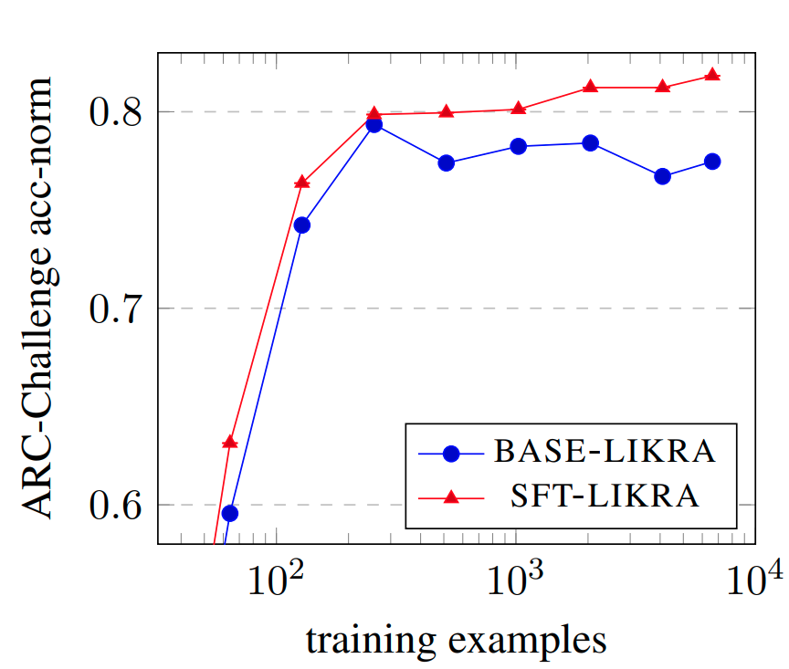

# How much do LLMs learn from negative examples? 
[](https://arxiv.org/abs/2503.14391)

## Highlight
How much do negative examples contribute during training? To answer this, we introduce the Likra (Likelihood-Ratio) model to investigate the impact of negative examples on Large Language Model (LLM) training. The key finding is that negative examples, especially plausible but incorrect "near-misses," can lead to significantly more efficient learning and improved discriminative capabilities, suggesting a potential shift in how LLM training data is composed and utilized. With Likra, we show that, given a very limited dataset (<128 examples), each additional negative example can improve the accuracy of a model 10X more than a positive example. Given this insight, we are able to train a version of Likra that achieves very similar performance to using both positive and negative examples while **ONLY** being trained on negative examples. 



## News
- **`[2025/03/18]`** [Likra](https://arxiv.org/abs/2503.14391) paper and code release!


## Training and Evaluation
### Preliminaries

#### Huggingface credentials
To use the original models Llama and Mistral, you need to have a Huggingface account which is granted access to the models. If any of the below steps fail, please check if you have access to the models by visiting the Huggingface model pages from the error messages. to login with your API credentials, run the following command and enter your credentials when prompted:

```bash
huggingface-cli login
```

### Installation

```bash
conda create -n lik python==3.11
conda activate lik
pip install -r reqs.txt

# Clone lm-eval fork
git clone git@github.com:Shamdan17/lm-evaluation-harness.git lm-eval-no-softmax
cd lm-eval-no-softmax
pip install -e .
cd ..
```

### Running 

```bash
# Simply run any of the makefile commands
make winogrande_base_lm3pt3
```

### Evaluation
```bash
# Evaluate likra (Positive + negative head)
make eval_winogrande_base_lm3pt3_likra
# Evaluate likra (Base + negative head)
make eval_winogrande_base_lm3pt3_negbase
# Evaluate SFT (Positive head only)
make eval_winogrande_base_lm3pt3_sft
```

## Citation

If you use this work, please cite:

```bibtex
@article{hamdan2025likra,
  title={How much do LLMs learn from negative examples?},
  author={Hamdan, Shadi and Yuret, Deniz},
  journal={arXiv preprint arXiv:2503.14391},
  year={2025}
}
```